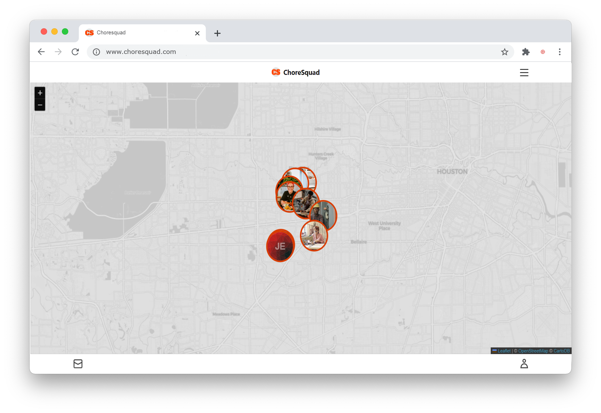
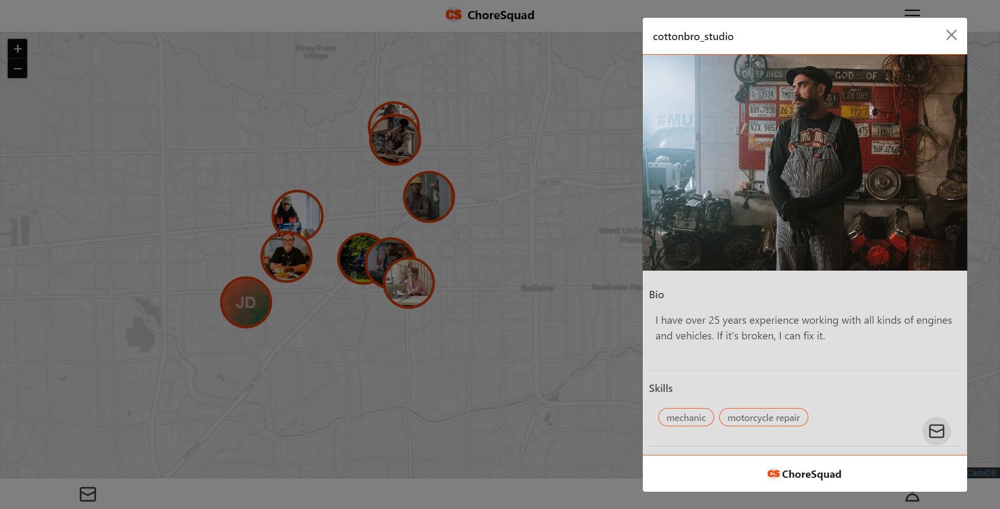
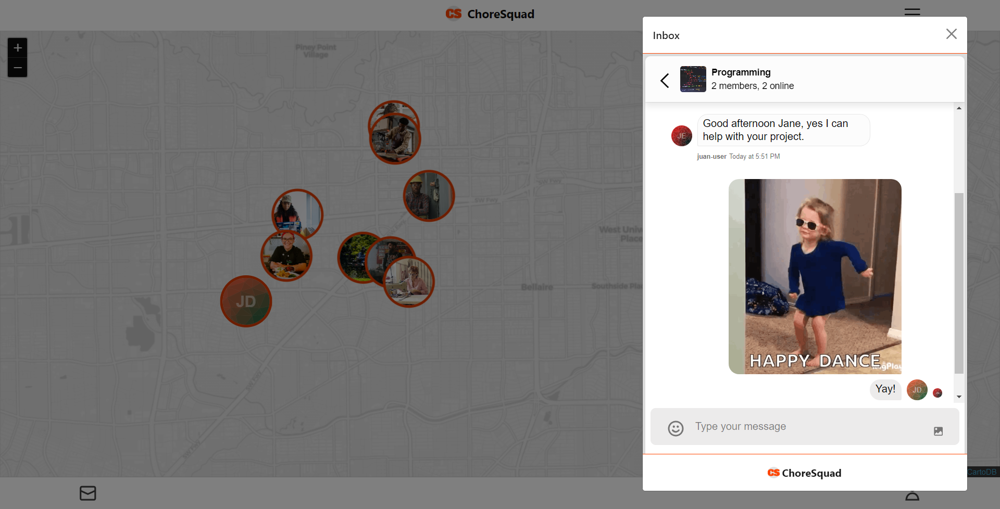

#  Choresquad

When you're short on time but your home project must get done, get help from skilled people in your community or become part of the Choresquad and put your skills to work and get paid doing what you're good at.

## Built With
This project was built using:

 
 
 

## Features

- User Signup/Login validation

- Chat messaging

- Displays users within your area

- Responsive design

## API used for this project
This project utilizes [Chat by Stream](https://getstream.io/chat/).
